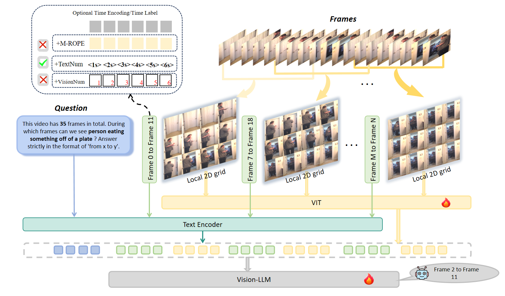

# T2SGrid: Temporal-to-Spatial Gridification for Video Temporal Grounding

[](https://arxiv.org/abs/2603.06973v1)

Official implementation of **T2SGrid**, accepted by **CVPR 2026**.

This paper proposes a new temporal encoding method called Temporal-to-Spatial Gridification (T2SGrid) to enhance the video temporal grounding performance of Vision-LLMs. Specifically, T2SGrid first utilizes a sliding window to group adjacent sequential frames and then arranges this frame sequence into a 2D spatial layout for the Vision-LLMs to process. This gridification mechanism well exploits the pre-existing spatial reasoning abilities of Vision-LLMs to conduct temporal reasoning and it is further improved by a more integrated textual timestamp prompting to inject the global time awareness along the entire video timeline.
We support **sequence input**, **grid input**, and **mixed sequence-grid training**.



## News
- [2026.03.11] Code released.
- [2026.02.21] Paper accepted to CVPR 2026.


# Setup

```bash
conda create -n t2sgrid python=3.10
pip install torch==2.6.0+cu118 torchvision==0.21.0+cu118  --index-url https://download.pytorch.org/whl/cu118 
pip install transformers==4.57.0 accelerate
pip install flash_attn==2.6.3
pip install trl==0.17.0
pip install qwen_vl_utils==0.0.14
pip install deepspeed decord moviepy
# Install any missing dependencies if needed
```

# Data Preparation
- Download model [Qwen2-VL-7B](https://www.modelscope.cn/models/Qwen/Qwen2-VL-7B-Instruct), [Qwen3-VL-8B](https://www.modelscope.cn/models/Qwen/Qwen3-VL-8B-Instruct), [LLaVA-OneVision-1.5-8B](https://huggingface.co/lmms-lab/LLaVA-OneVision-1.5-8B-Instruct)  and datasets [Charades-STA](https://prior.allenai.org/projects/charades),  [ActivityNet-Caption](https://huggingface.co/datasets/yeliudev/VideoMind-Dataset/tree/main/activitynet)
- Specify your dataset path in data/data_config.py and your model path in eval/utils.py.
- Process the video into a grid image for input

```bash
export PYTHONPATH=./
# if you just want to eval
python  data/preprocess/video_to_grid.py --grid_size 4 3   --fps 1 --stride 6 --line_width 0 --split "test" --thumb_size 336 336 --dataset "charades"

python  data/preprocess/video_to_grid.py --grid_size 4 3   --fps 0.5 --stride 12 --line_width 0 --split "test" --thumb_size 336 336 --dataset "anet"

# if you want to train the T2SGrid

python  data/preprocess/video_to_grid.py --grid_size 4 3   --fps 1 --stride 6 --line_width 0 --split "train" --thumb_size 336 336 --dataset "charades"

python  data/preprocess/video_to_grid.py --grid_size 4 3   --fps 0.5 --stride 12 --line_width 0 --split "train" --thumb_size 336 336 --dataset "anet"

```


# Evaluation
- Eval Charades-STA 
```bash
# using sequence input
python eval/vtg/qwenvl_eval_seq.py  --model_name qwen2vl  --dataset charades --splits test  --prompt_type  numpro
python eval/vtg/qwenvl_eval_seq.py  --model_name qwen3vl  --dataset charades --splits test  --prompt_type  numpro
python eval/vtg/qwenvl_eval_seq.py  --model_name llava_ov_15  --dataset charades --splits test  --prompt_type  numpro
# using grid input
python eval/vtg/qwenvl_eval_grid.py \
  --model_name qwen2vl \
  --dataset anet \
  --splits test \
  --prompt_type numpro \
  --video_grid_dir g43_f0.5_s12_r1_l0_ts336x336
# change model_name same as sequence input
```
- Eval ActivityNet-Caption
```bash
# using sequence input
python eval/vtg/qwenvl_eval_seq.py  --model_name qwen2vl  --dataset anet --splits test  --prompt_type  numpro
# using grid input
python eval/vtg/qwenvl_eval_seq.py  --model_name qwen2vl  --dataset anet --splits test  --prompt_type  numpro
--video_grid_dir  g43_f0.5_s12_r1_l0_ts336x336
```

# Training
- Training using seq input, run ```scripts/run_sft_seq_qwen2vl.sh``` 
- Training using grid input, run  ```scripts/run_sft_grid_qwen2vl.sh``` 
- Training using grid and seq mixed input, grid input can provide complementary auxiliary signals to seq input, run  ```scripts/run_sft_seq_grid_mixed_qwen2vl.sh``` 

# Acknowledgement
Our implementation is based on the following repositories:

- https://github.com/yongliang-wu/NumPro
- https://github.com/OpenGVLab/VideoChat-R1

We thank the authors for their excellent works.
